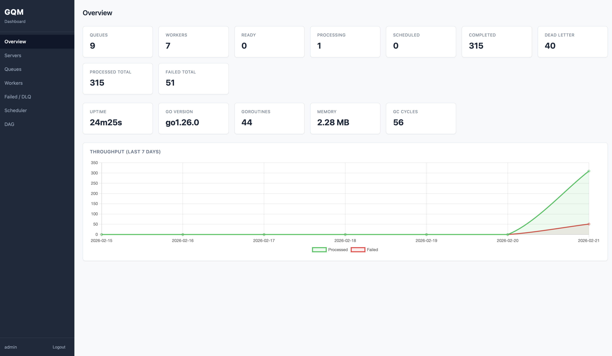
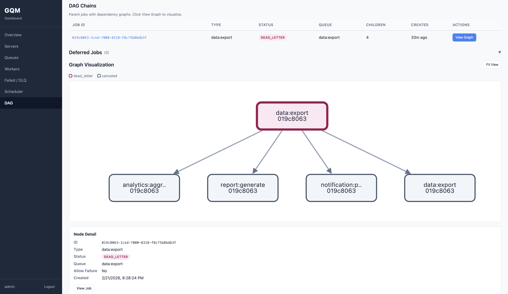
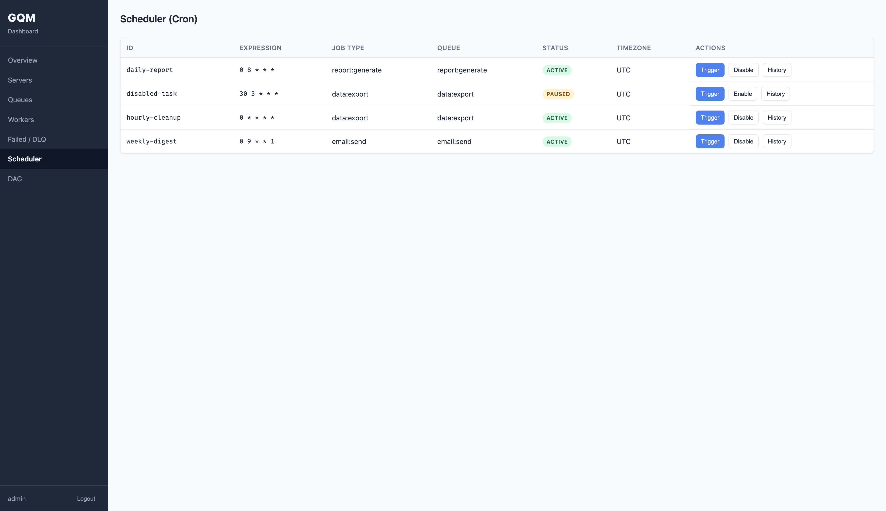
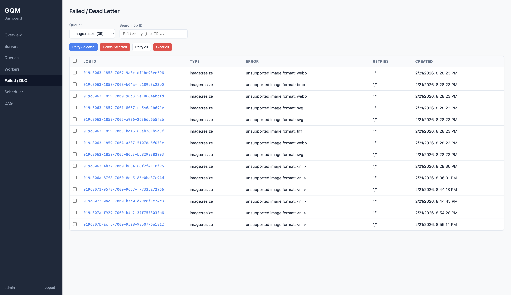
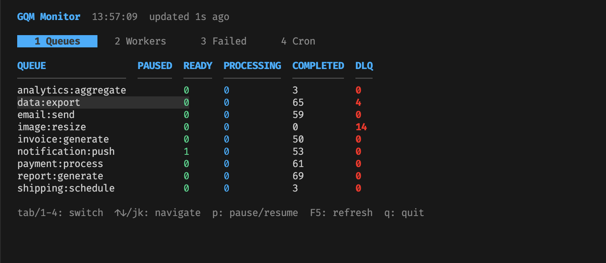
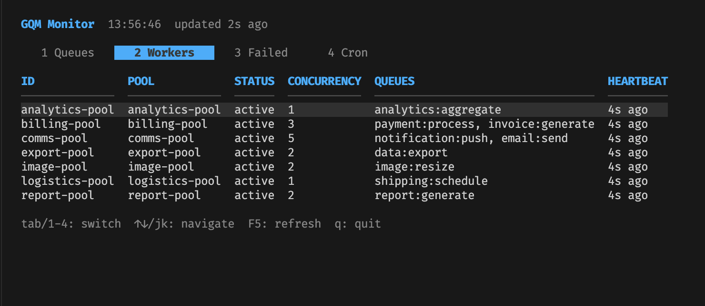

# GQM — Go Queue Manager
[](https://pkg.go.dev/github.com/benedict-erwin/gqm)
[](https://goreportcard.com/report/github.com/benedict-erwin/gqm)
[](LICENSE)
[](https://github.com/benedict-erwin/gqm/releases)
[](https://golang.org)

Redis-based task queue library for Go. Built from scratch with minimal dependencies, progressive disclosure API, and production-grade features including worker isolation, DAG dependencies, cron scheduling, and an embedded monitoring dashboard.

## Features

- **Worker pool isolation** — Dedicated goroutine pools per job type with independent concurrency, timeout, and retry policies
- **DAG job dependencies** — Linear chains or full DAG (Directed Acyclic Graph) with cycle detection, cascade cancellation, and per-dependency failure tolerance
- **Cron scheduler** — 6-field cron expressions (incl. seconds), overlap policies (skip/allow/replace), timezone support, distributed locking
- **Delayed jobs** — Schedule jobs for future execution with `EnqueueAt()` / `EnqueueIn()`
- **Retry & dead letter queue** — Configurable retry with fixed/exponential/custom backoff, automatic DLQ after max retries
- **Unique jobs** — Idempotent enqueue via `Unique()` option (backed by atomic `HSETNX`)
- **Dequeue strategies** — Strict priority, round-robin, or weighted (default) across multi-queue pools
- **Timeout hierarchy** — Job-level → pool-level → global default (always enforced, never disabled)
- **Middleware** — Global handler middleware chain via `Server.Use()` for logging, metrics, tracing
- **Error classification** — `IsFailure` predicate separates transient errors (retry without counting) from real failures
- **Skip retry** — `ErrSkipRetry` sentinel error bypasses all retries, sends job directly to DLQ
- **Job callbacks** — `OnSuccess`, `OnFailure`, `OnComplete` per-handler callbacks with panic recovery
- **Bulk enqueue** — `EnqueueBatch()` creates up to 1000 jobs in a single Redis pipeline
- **Panic recovery** — Handler panics are caught per-goroutine; worker pools remain operational
- **Graceful shutdown** — In-flight jobs complete before exit, with configurable grace period
- **YAML config** — Full config-file-driven deployment with 20+ structural validation rules
- **Progressive disclosure** — Zero-config to start, full control when needed (4 layers)
- **HTTP monitoring API** — 32 REST endpoints for queue stats, job management, worker status, cron control
- **Web dashboard** — Embedded vanilla HTML/CSS/JS dashboard with auth, RBAC (admin/viewer), CSRF protection
- **CLI tool** — Config management, password hashing, API key generation, dashboard export
- **TUI monitor** — Terminal UI with live queue/worker/cron monitoring (separate Go module)
- **Atomic operations** — 12 Lua scripts for race-free Redis state transitions
- **Redis TLS** — `WithRedisTLS()` option or `redis.tls: true` config for encrypted connections (pass custom `*tls.Config` or `nil` for system defaults)
- **API rate limiting** — Per-IP token bucket on all API endpoints (default 100 req/s, configurable via `monitoring.api.rate_limit`, `/health` exempt)
- **Redis Sentinel support** — Inject pre-configured `*redis.Client` via `WithRedisClient()` for Sentinel, Cluster, or custom setups
- **Minimal dependencies** — Core library: 3 deps (go-redis, yaml.v3, x/crypto). CLI adds x/term for interactive input

## Screenshots

### Web Dashboard
| Overview | DAG Dependencies |
|---|---|
|  |  |

| Scheduler | Failed / DLQ |
|---|---|
|  |  |

### Terminal UI (TUI)
| Queues | Workers |
|---|---|
|  |  |

## Requirements

- Go 1.22+
- Redis 6.2+ (for `BLMOVE`)

## Installation

```bash
# Core library
go get github.com/benedict-erwin/gqm

# TUI (optional, separate module)
go get github.com/benedict-erwin/gqm/tui

# CLI binary
go install github.com/benedict-erwin/gqm/cmd/gqm@latest
```

## Quick Start

### Layer 1 — Zero Config

```go
// Producer: enqueue jobs
client, _ := gqm.NewClient(gqm.WithRedisAddr("localhost:6379"))
defer client.Close()

client.Enqueue("email.send", gqm.Payload{
    "to":      "user@example.com",
    "subject": "Welcome",
})

// Consumer: process jobs (shared default pool)
server, _ := gqm.NewServer(gqm.WithServerRedis("localhost:6379"))
server.Handle("email.send", func(ctx context.Context, job *gqm.Job) error {
    var p EmailPayload
    job.Decode(&p)
    return sendEmail(ctx, p.To, p.Subject)
})
server.Start(context.Background())
```

### Layer 2 — Per-Handler Concurrency

```go
server, _ := gqm.NewServer(gqm.WithServerRedis("localhost:6379"))

// Each handler gets a dedicated pool with N workers
server.Handle("email.send", emailHandler, gqm.Workers(5))
server.Handle("payment.process", paymentHandler, gqm.Workers(3))

server.Start(context.Background())
```

### Layer 3 — Explicit Pools

```go
server, _ := gqm.NewServer(
    gqm.WithServerRedis("localhost:6379"),
    gqm.WithAPI(true, ":8080"),
    gqm.WithDashboard(true),
)

server.Pool(gqm.PoolConfig{
    Name:        "email-pool",
    JobTypes:    []string{"email.send", "email.bulk"},
    Queues:      []string{"critical", "email"},  // priority order
    Concurrency: 10,
    JobTimeout:  30 * time.Second,
    DequeueStrategy: gqm.StrategyWeighted,
    RetryPolicy: &gqm.RetryPolicy{
        MaxRetry:    5,
        Backoff:     gqm.BackoffExponential,
        BackoffBase: 10 * time.Second,
        BackoffMax:  10 * time.Minute,
    },
})

server.Handle("email.send", sendHandler)
server.Handle("email.bulk", bulkHandler)
server.Start(context.Background())
```

### Layer 4 — Config File

Define everything in YAML — pools, queues, cron, auth, dashboard. See [YAML Configuration](#yaml-configuration) below.

```go
cfg, _ := gqm.LoadConfigFile("gqm.yaml")
server, _ := gqm.NewServerFromConfig(cfg)
server.Handle("email.send", emailHandler)
server.Start(context.Background())
```

## YAML Configuration

Generate a template with `gqm init`, then customize:

```yaml
# gqm.yaml
redis:
  addr: "localhost:6379"
  password: ""
  db: 0
  prefix: "gqm"

app:
  timezone: "Asia/Jakarta"
  log_level: "info"               # debug, info, warn, error
  shutdown_timeout: 30            # seconds
  global_job_timeout: 1800        # seconds (30 min default, cannot be disabled)
  grace_period: 10                # seconds

queues:
  - name: "critical"
    priority: 10
  - name: "default"
    priority: 1
  - name: "low"
    priority: 0

pools:
  - name: "fast"
    job_types: ["email.send", "notification.push"]
    queues: ["critical", "default"]
    concurrency: 10
    job_timeout: 60
    dequeue_strategy: "weighted"  # strict, round_robin, weighted
    retry:
      max_retry: 5
      backoff: "exponential"      # fixed, exponential, custom
      backoff_base: 10            # seconds
      backoff_max: 3600           # seconds
  - name: "background"
    job_types: ["*"]              # catch-all for unassigned job types
    queues: ["default", "low"]
    concurrency: 3

scheduler:
  enabled: true
  poll_interval: 5                # seconds — how often to check for due jobs
                                  # lower = faster promotion, higher Redis load
  cron_entries:
    - id: "cleanup-daily"
      name: "Daily cleanup"
      cron_expr: "0 0 2 * * *"   # 6-field: sec min hour dom month dow
      timezone: "UTC"
      job_type: "cleanup"
      queue: "default"
      overlap_policy: "skip"      # skip, allow, replace

monitoring:
  auth:
    enabled: true
    session_ttl: 86400
    users:
      - username: "admin"
        password_hash: ""         # gqm set-password admin
        role: "admin"             # admin or viewer
  api:
    enabled: true
    addr: ":8080"
    api_keys:
      - name: "grafana"
        key: ""                   # gqm add-api-key grafana
        role: "viewer"
  dashboard:
    enabled: true
    path_prefix: "/dashboard"
    # custom_dir: "./my-dashboard"  # override embedded dashboard
```

Code options always override config values:

```go
cfg, _ := gqm.LoadConfigFile("gqm.yaml")
server, _ := gqm.NewServerFromConfig(cfg,
    gqm.WithGlobalTimeout(10 * time.Minute), // overrides app.global_job_timeout
    gqm.WithSchedulerEnabled(false),         // worker-only instance
)
```

## Enqueue Options

```go
client.Enqueue("report.generate", payload,
    gqm.Queue("reports"),                      // target queue (default: "default")
    gqm.MaxRetry(5),                           // max retry attempts
    gqm.Timeout(2 * time.Minute),              // job-level timeout
    gqm.RetryIntervals(10, 30, 60, 300),       // custom backoff (seconds)
    gqm.JobID("report-2026-02"),               // custom job ID (default: UUID v7)
    gqm.Meta(map[string]string{"user": "42"}), // arbitrary metadata
    gqm.EnqueuedBy("api-gateway"),             // audit trail
    gqm.EnqueueAtFront(true),                  // push to front of queue
    gqm.Unique(),                              // idempotent (requires custom JobID)
    gqm.DependsOn(parentID),                   // DAG dependency
    gqm.AllowFailure(true),                    // run even if parent fails
)
```

## Middleware

Register global middleware that wraps every handler. Middleware executes in registration order (onion model: a → b → handler → b → a).

```go
srv.Use(func(next gqm.Handler) gqm.Handler {
    return func(ctx context.Context, job *gqm.Job) error {
        slog.Info("job start", "id", job.ID, "type", job.Type)
        start := time.Now()
        err := next(ctx, job)
        slog.Info("job done", "id", job.ID, "duration", time.Since(start), "error", err)
        return err
    }
})
```

`Use()` returns an error if called after `Start()` or with a nil middleware. Register all middleware before starting the server.

## Error Classification

### ErrSkipRetry

Wrap any error with `ErrSkipRetry` to bypass all retries and send the job directly to the dead letter queue:

```go
server.Handle("payment.charge", func(ctx context.Context, job *gqm.Job) error {
    err := gateway.Charge(ctx, job.Payload["card_id"])
    if errors.Is(err, ErrInvalidCard) {
        return fmt.Errorf("invalid card: %w", gqm.ErrSkipRetry) // no retry, straight to DLQ
    }
    return err // normal retry on other errors
})
```

### IsFailure Predicate

Classify handler errors as transient or real failures. Transient errors (predicate returns `false`) retry without incrementing the retry counter — they don't count toward the retry limit:

```go
server.Handle("api.call", apiHandler,
    gqm.Workers(3),
    gqm.IsFailure(func(err error) bool {
        // Rate limits and timeouts are transient — retry indefinitely
        if errors.Is(err, ErrRateLimit) || errors.Is(err, context.DeadlineExceeded) {
            return false
        }
        return true // everything else counts as a real failure
    }),
)
```

## Job Callbacks

Per-handler callbacks fire after job execution. All callbacks include panic recovery.

```go
server.Handle("order.process", orderHandler,
    gqm.Workers(5),

    gqm.OnSuccess(func(ctx context.Context, job *gqm.Job) {
        metrics.OrderProcessed.Inc()
    }),

    gqm.OnFailure(func(ctx context.Context, job *gqm.Job, err error) {
        alerting.Notify(fmt.Sprintf("order %s failed: %v", job.ID, err))
    }),

    gqm.OnComplete(func(ctx context.Context, job *gqm.Job, err error) {
        audit.Log("order.process", job.ID, err)
    }),
)
```

Callbacks run synchronously in the worker goroutine before the next job is dequeued. Keep them fast — for heavy work, spawn a goroutine inside the callback.

## Bulk Enqueue

Create multiple jobs in a single Redis pipeline:

```go
items := []gqm.BatchItem{
    {JobType: "email.send", Payload: gqm.Payload{"to": "a@x.com"}, Options: []gqm.EnqueueOption{gqm.MaxRetry(3)}},
    {JobType: "email.send", Payload: gqm.Payload{"to": "b@x.com"}, Options: []gqm.EnqueueOption{gqm.MaxRetry(3)}},
    {JobType: "email.send", Payload: gqm.Payload{"to": "c@x.com"}, Options: []gqm.EnqueueOption{gqm.MaxRetry(3)}},
}

jobs, err := client.EnqueueBatch(ctx, items)
// jobs[0].ID, jobs[1].ID, jobs[2].ID — all created in one pipeline
```

**Limits:** max 1000 items per batch. `DependsOn`, `Unique`, and `EnqueueAtFront` are not supported in batch mode.

## Custom Redis Client (Sentinel / Cluster)

GQM connects to a standalone Redis by default. For Sentinel, Cluster, or any custom go-redis configuration, inject a pre-configured `*redis.Client`:

```go
// Redis Sentinel
rdb := redis.NewFailoverClient(&redis.FailoverOptions{
    MasterName:    "mymaster",
    SentinelAddrs: []string{"sentinel1:26379", "sentinel2:26379", "sentinel3:26379"},
    Password:      "secret",
})

client, _ := gqm.NewClient(gqm.WithRedisClient(rdb))
server, _ := gqm.NewServer(gqm.WithServerRedisClient(rdb))
```

When `WithRedisClient` is used, connection options (`WithRedisAddr`, `WithRedisPassword`, etc.) are ignored — only `WithPrefix` still applies.

## Delayed & Scheduled Jobs

```go
// Run at a specific time
client.EnqueueAt("report.generate", payload, time.Date(2026, 3, 1, 0, 0, 0, 0, time.UTC))

// Run after a delay
client.EnqueueIn("reminder.send", payload, 24 * time.Hour)
```

Jobs are held in a Redis sorted set (scored by timestamp) and promoted to the ready queue by the scheduler engine.

## Job Dependencies (DAG)

```go
jobA, _ := client.Enqueue("step.one", payloadA)
jobB, _ := client.Enqueue("step.two", payloadB)

// jobC runs only after both A and B complete successfully
jobC, _ := client.Enqueue("step.three", payloadC,
    gqm.DependsOn(jobA.ID, jobB.ID),
)
```

**Failure behavior:**

- **Default** — If a parent job fails (exhausts retries → DLQ), all dependent children are **cascade-canceled** recursively. The entire downstream chain is canceled.
- **`AllowFailure(true)`** — Opt-in per dependency. The child treats a failed parent as "resolved" and runs anyway once all dependencies are satisfied (completed or failed).

```go
//   A (fail)
//   ├── B                    → canceled (default)
//   │   └── D                → canceled (cascade from B)
//   └── C [AllowFailure]     → still runs (tolerates A's failure)
//       └── E                → runs after C completes

jobB, _ := client.Enqueue("step.b", p, gqm.DependsOn(jobA.ID))
jobC, _ := client.Enqueue("step.c", p, gqm.DependsOn(jobA.ID), gqm.AllowFailure(true))
jobD, _ := client.Enqueue("step.d", p, gqm.DependsOn(jobB.ID))
jobE, _ := client.Enqueue("step.e", p, gqm.DependsOn(jobC.ID))
```

Cycle detection (DFS, depth limit 100) runs at enqueue time — circular dependencies are rejected before any job is queued.

## Cron Scheduling

Cron works by automatically enqueuing jobs on a schedule. You define **what** to run (job type) and **when** (cron expression) — the scheduler handles the rest.

**Step 1: Register the handler** — this is the code that runs when the cron fires:

```go
// The handler is a regular job handler — same as any other job.
// The scheduler enqueues a job with this type on each cron tick.
server.Handle("cleanup", func(ctx context.Context, job *gqm.Job) error {
    deleted, err := db.DeleteExpiredSessions(ctx)
    if err != nil {
        return err // will retry based on retry policy
    }
    slog.Info("cleanup complete", "deleted", deleted)
    return nil
}, gqm.Workers(1))
```

**Step 2: Define the schedule** — either in code or YAML config:

```go
// Option A: in code
server.Schedule(gqm.CronEntry{
    ID:            "cleanup-daily",
    Name:          "Daily Session Cleanup",
    CronExpr:      "0 0 2 * * *",  // 6-field: sec min hour dom month dow
    Timezone:      "Asia/Jakarta",
    JobType:       "cleanup",       // must match the handler registered above
    Queue:         "default",
    OverlapPolicy: gqm.OverlapSkip, // skip | allow | replace
})
```

```yaml
# Option B: in gqm.yaml (same effect)
scheduler:
  cron_entries:
    - id: "cleanup-daily"
      name: "Daily Session Cleanup"
      cron_expr: "0 0 2 * * *"
      timezone: "Asia/Jakarta"
      job_type: "cleanup"
      queue: "default"
      overlap_policy: "skip"
```

**How it works:** The scheduler goroutine checks cron entries every `poll_interval` seconds. When an entry is due, it enqueues a new job with the specified `job_type` into the target `queue`. The job is then picked up by a worker pool that handles that job type — exactly like a manually enqueued job. Overlap policy controls what happens if the previous cron job is still running when the next tick fires.

## Monitoring

### Web Dashboard

Embedded vanilla HTML/CSS/JS dashboard — no build step, no npm. Served directly from the Go binary via `embed.FS`.

**Enable programmatically:**

```go
server, _ := gqm.NewServer(
    gqm.WithServerRedis("localhost:6379"),
    gqm.WithAPI(true, ":8080"),
    gqm.WithDashboard(true),
    gqm.WithAuthEnabled(true),
    gqm.WithAuthUsers([]gqm.AuthUser{
        {Username: "admin", PasswordHash: "$2a$10$...", Role: "admin"},
        {Username: "viewer", PasswordHash: "$2a$10$...", Role: "viewer"},
    }),
    gqm.WithAPIKeys([]gqm.AuthAPIKey{
        {Name: "grafana", Key: "gqm_ak_...", Role: "viewer"},
    }),
)
// Dashboard: http://localhost:8080/dashboard/
// Health:    http://localhost:8080/health (no auth)
```

**Or via YAML config:**

```yaml
monitoring:
  api:
    enabled: true
    addr: ":8080"
  dashboard:
    enabled: true
    # path_prefix: "/dashboard"     # default
    # custom_dir: "./my-dashboard"  # override embedded assets
  auth:
    enabled: true
    users:
      - username: admin
        password_hash: ""  # generate with: gqm hash-password
        role: admin
```

**Dashboard pages:**

| Page | Description |
|------|-------------|
| Overview | Job stats with Chart.js graphs, stat cards per status |
| Servers | Live server heartbeats, uptime, active jobs |
| Queues | Queue sizes, pause/resume, empty queue, DLQ retry |
| Workers | Per-pool worker status, active job tracking |
| Failed / DLQ | Failed job browser, retry/delete individual or batch |
| Scheduler | Cron entries, next/last run, trigger/enable/disable |
| DAG | Dependency graph visualization with Cytoscape.js |

**Auth & security:** Session cookies (bcrypt + HttpOnly/Secure/SameSite), API keys with constant-time comparison, RBAC (admin/viewer), CSRF protection, login rate limiting. Health check at `GET /health` requires no auth.

### REST API

32 endpoints under `/api/v1/`. Authenticate via session cookie (dashboard) or `X-API-Key` header (programmatic). Write endpoints require `X-GQM-CSRF: 1` header (API key exempt).

```bash
# List queues with API key
curl -H "X-API-Key: gqm_ak_xxx" http://localhost:8080/api/v1/queues

# Pause a queue (admin only, CSRF header required for session auth, exempt for API key)
curl -X POST -H "X-API-Key: gqm_ak_xxx" http://localhost:8080/api/v1/queues/email:send/pause
```

**Read endpoints:**

| Method | Endpoint | Description |
|--------|----------|-------------|
| GET | `/api/v1/queues` | List all queues with per-status counts |
| GET | `/api/v1/queues/{name}` | Queue detail |
| GET | `/api/v1/queues/{name}/jobs?status=ready&page=1&limit=20` | Paginated job list |
| GET | `/api/v1/jobs/{id}` | Single job detail |
| GET | `/api/v1/workers` | List pools with concurrency, queues, active jobs |
| GET | `/api/v1/stats` | Overview: total counts, worker count, uptime |
| GET | `/api/v1/cron` | List cron entries with next/last run |
| GET | `/api/v1/cron/{id}/history` | Cron execution history |
| GET | `/api/v1/servers` | Active server instances |
| GET | `/api/v1/dag/deferred` | List deferred jobs (waiting on dependencies) |
| GET | `/api/v1/dag/roots` | List DAG root jobs |
| GET | `/api/v1/dag/{id}/graph` | DAG graph (nodes + edges for visualization) |

**Admin endpoints** (require `admin` role):

| Method | Endpoint | Description |
|--------|----------|-------------|
| POST | `/api/v1/queues/{name}/pause` | Pause queue (workers stop dequeuing) |
| POST | `/api/v1/queues/{name}/resume` | Resume queue |
| DELETE | `/api/v1/queues/{name}/empty` | Delete all ready jobs |
| POST | `/api/v1/queues/{name}/dead-letter/retry-all` | Retry all DLQ jobs |
| DELETE | `/api/v1/queues/{name}/dead-letter/clear` | Clear DLQ |
| POST | `/api/v1/jobs/{id}/retry` | Retry single job |
| POST | `/api/v1/jobs/{id}/cancel` | Cancel job (cascades to DAG dependents) |
| DELETE | `/api/v1/jobs/{id}` | Delete job |
| POST | `/api/v1/jobs/batch/retry` | Batch retry (body: `{"job_ids": [...]}`) |
| POST | `/api/v1/jobs/batch/delete` | Batch delete |
| POST | `/api/v1/cron/{id}/trigger` | Manual trigger cron entry |
| POST | `/api/v1/cron/{id}/enable` | Enable cron entry |
| POST | `/api/v1/cron/{id}/disable` | Disable cron entry |

**Auth endpoints:**

| Method | Endpoint | Description |
|--------|----------|-------------|
| POST | `/auth/login` | Form login → session cookie |
| POST | `/auth/logout` | Destroy session |
| GET | `/auth/me` | Current user info |
| GET | `/health` | Health check (no auth, no rate limit) |

**Customizing the dashboard:**

You can replace the built-in dashboard with your own HTML/CSS/JS files. GQM's REST API remains fully available as your backend.

```bash
# Step 1: Export the built-in dashboard as a starting point
gqm dashboard export ./my-dashboard

# Step 2: Edit the files in ./my-dashboard/ (HTML, CSS, JS)

# Step 3: Point your server to the custom directory
```

```go
server, _ := gqm.NewServer(
    gqm.WithServerRedis("localhost:6379"),
    gqm.WithAPI(true, ":8080"),
    gqm.WithDashboard(true),
    gqm.WithDashboardDir("./my-dashboard"),   // override embedded dashboard
    gqm.WithDashboardPathPrefix("/my-panel"),  // optional: change URL path (default: /dashboard)
)
```

Or via YAML config:

```yaml
monitoring:
  dashboard:
    enabled: true
    custom_dir: "./my-dashboard"
    path_prefix: "/my-panel"
```

When `custom_dir` is set, GQM serves files entirely from that directory instead of the embedded assets. All API endpoints (`/api/v1/*`, `/auth/*`, `/health`) continue to work normally — only the dashboard static files are replaced. See [`_examples/11-custom-dashboard`](_examples/11-custom-dashboard/) for a working example.

### TUI

Terminal UI for quick monitoring without a browser. Connects to a running GQM server via the HTTP API.

```bash
# Requires a server with monitoring enabled (WithAPI or monitoring.enabled in YAML)
gqm tui --api-url http://localhost:8080 --api-key gqm_ak_xxx

# Or via environment variables
export GQM_API_URL=http://localhost:8080
export GQM_API_KEY=gqm_ak_xxx
gqm tui
```

4 tabs: Queues, Workers, Failed, Cron. Auto-refreshes every second.

**Keyboard shortcuts:**

| Key | Action |
|-----|--------|
| `1-4` | Switch tab directly |
| `Tab` / `Shift+Tab` | Cycle tabs |
| `j/k` or `Up/Down` | Navigate list |
| `h/l` or `Left/Right` | Switch queue (Failed tab) |
| `p` | Pause/resume queue (Queues tab) |
| `r` | Retry failed job (Failed tab) |
| `t` | Trigger cron entry (Cron tab) |
| `e` | Enable/disable cron entry (Cron tab) |
| `F5` | Force refresh |
| `q` / `Ctrl+C` | Quit |

### CLI

```
gqm init                    Generate template gqm.yaml
gqm set-password <user>     Set/update dashboard password
gqm add-api-key <name>      Add API key to config
gqm revoke-api-key <name>   Remove API key from config
gqm hash-password           Generate bcrypt hash
gqm generate-api-key        Generate random API key
gqm dashboard export <dir>  Export embedded dashboard for customization
gqm tui [--api-url <url>] [--api-key <key>]  Launch terminal monitor
gqm version                 Show version
```

## Performance

Benchmarked on Linux arm64 (Docker), Redis 7, Go 1.26, 4 vCPU. All operations use Lua scripts for atomic Redis state transitions.

### Throughput

| Operation | Latency | Throughput |
|-----------|--------:|----------:|
| Single enqueue | ~55 µs | **18,100 jobs/sec** |
| End-to-end (enqueue → process → complete) | ~100 µs | **10,000 jobs/sec** |
| Batch enqueue (100 jobs) | ~726 µs | **137,700 jobs/sec** |
| Batch enqueue (1000 jobs) | ~7.3 ms | **137,800 jobs/sec** |
| Burst drain (30 workers) | — | **19,700 jobs/sec** |
| Large payload 10 KB | — | **1,607 jobs/sec** |
| Large payload 100 KB | — | **346 jobs/sec** |

### Stress Test Highlights

| Scenario | Result |
|----------|--------|
| Data integrity (10K jobs, 20 workers) | **Zero loss, zero duplicates** |
| Sustained load (30s, 558K jobs) | **Zero loss**, p50 latency 3.2s, drain 3.8s |
| Retry storm (2K jobs × 4 attempts) | All 8K attempts processed correctly |
| High concurrency (60 workers, 3 pools) | Stable, no goroutine or memory leaks |
| Backpressure (735K queue depth) | System responsive, no degradation |
| Panic recovery (500 panics) | All recovered, workers remain operational |

### Resource Efficiency

- **Minimal dependencies** — core library: 3 deps; CLI adds 1 (see [Dependencies](#dependencies))
- **12 Lua scripts** — all Redis state transitions are atomic
- **Zero goroutine leaks** — verified across all stress test scenarios
- **Memory stable** — no runaway growth under sustained load

## Architecture

```
Producer App                  Redis                     Worker Binary
─────────────                 ─────                     ────────────
gqm.Client                                              gqm.Server
  .Enqueue() ──────────────►  Queues (Lists)  ◄───────  Pool "email" (5 workers)
  .EnqueueAt()                Jobs (Hashes)             Pool "payment" (3 workers)
  .EnqueueIn()                Scheduled (ZSet)          Scheduler (delayed + cron)
                              Cron (Hash)               Heartbeat (1/pool)
                              Sessions (Strings)        HTTP API + Dashboard
```

## Dependencies

**Core library** (what you get with `go get github.com/benedict-erwin/gqm`):

| Dependency | Purpose |
|---|---|
| `github.com/redis/go-redis/v9` | Redis client |
| `gopkg.in/yaml.v3` | YAML config parsing |
| `golang.org/x/crypto/bcrypt` | Password hashing (dashboard auth) |

**CLI binary** (`cmd/gqm/`) adds:

| Dependency | Purpose |
|---|---|
| `golang.org/x/term` | Interactive password input (`gqm set-password`) |

**TUI module** (`gqm/tui`) is a separate Go module within the same repo — importing the core library does not pull TUI dependencies (bubbletea, lipgloss, etc.).

Everything else is stdlib or implemented from scratch (UUID v7, cron parser, HTTP router via Go 1.22+, logging via `log/slog`).

## License

MIT

## Built With

- **Go 1.22+** — core language
- **Redis 7** — backbone storage
- **Claude (Anthropic)** — AI pair programming assistant for implementation & docs

