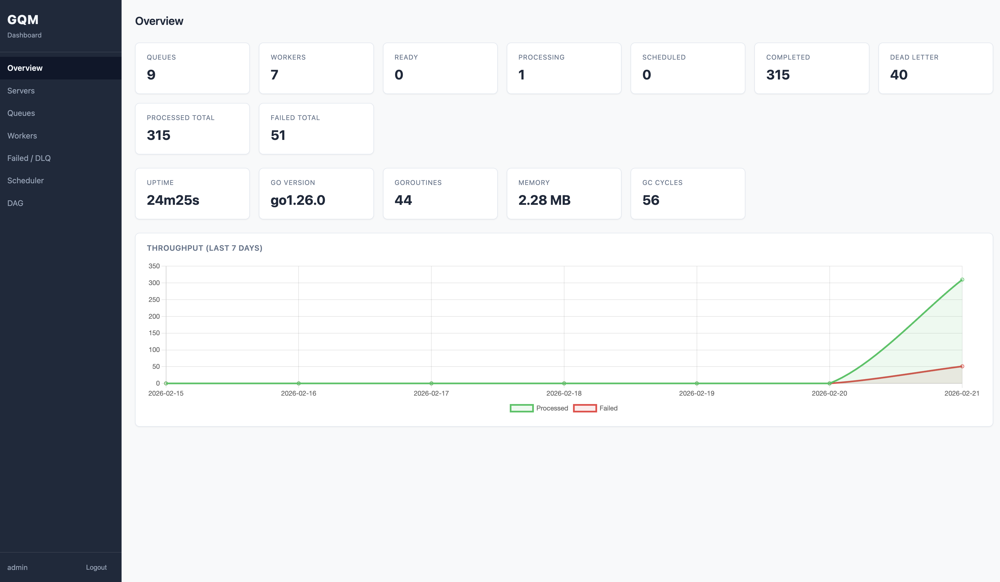
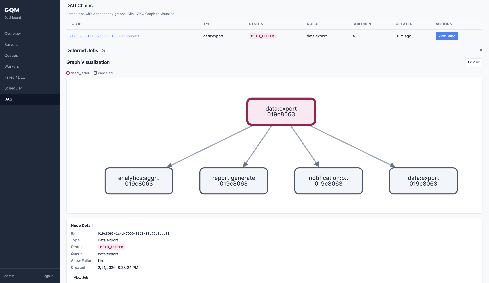
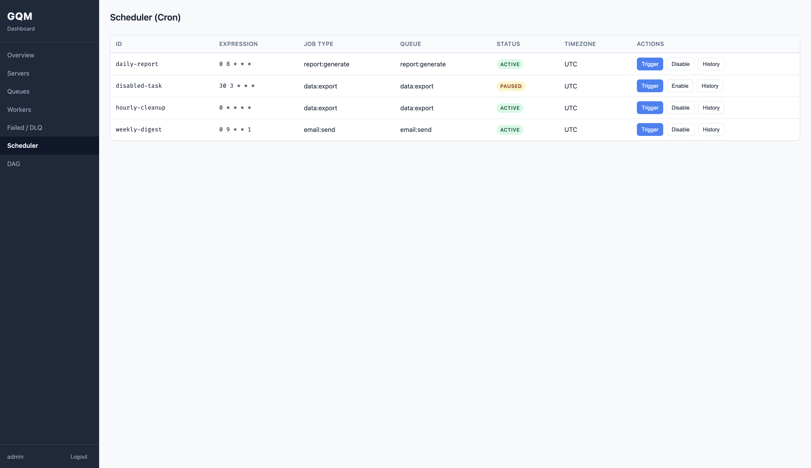
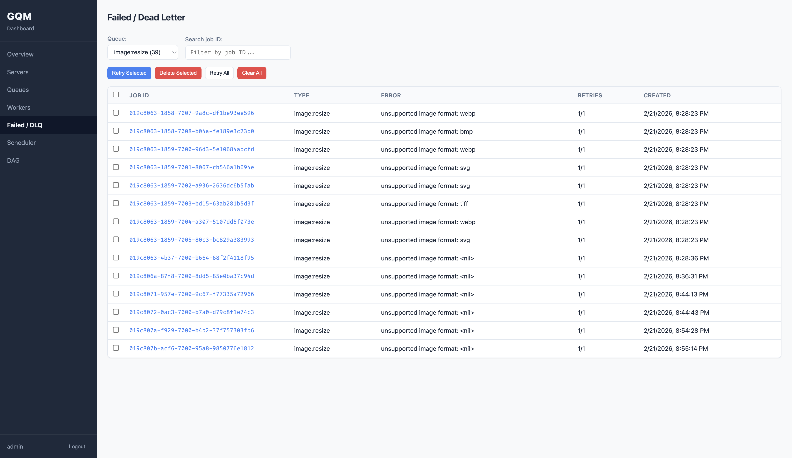
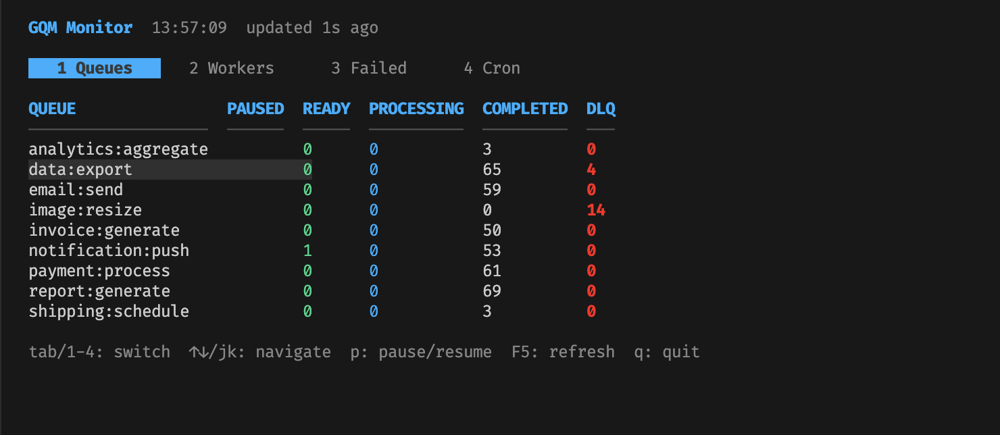
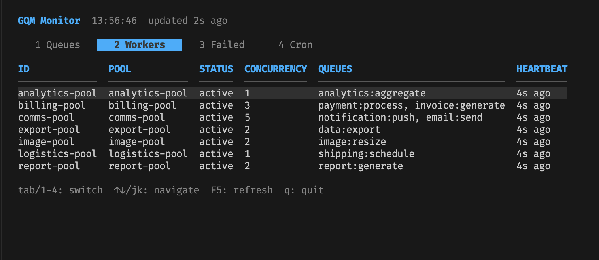

# GQM — Go Queue Manager
[](https://pkg.go.dev/github.com/benedict-erwin/gqm)
[](https://goreportcard.com/report/github.com/benedict-erwin/gqm)
[](LICENSE)
[](https://github.com/benedict-erwin/gqm/releases)
[](https://golang.org)

Redis-based task queue library for Go. Built from scratch with minimal dependencies, progressive disclosure API, and production-grade features including worker isolation, DAG dependencies, cron scheduling, and an embedded monitoring dashboard.

## Features

- **Worker pool isolation** — Dedicated goroutine pools per job type with independent concurrency, timeout, and retry policies
- **DAG job dependencies** — Linear chains or full DAG (Directed Acyclic Graph) with cycle detection, cascade cancellation, and per-dependency failure tolerance
- **Cron scheduler** — 6-field cron expressions (incl. seconds), overlap policies (skip/allow/replace), timezone support, distributed locking
- **Delayed jobs** — Schedule jobs for future execution with `EnqueueAt()` / `EnqueueIn()`
- **Retry & dead letter queue** — Configurable retry with fixed/exponential/custom backoff, automatic DLQ after max retries
- **Unique jobs** — Idempotent enqueue via `Unique()` option (backed by atomic `HSETNX`)
- **Dequeue strategies** — Weighted (default), strict priority, or round-robin across multi-queue pools
- **Timeout hierarchy** — Job-level → pool-level → global default (always enforced, never disabled)
- **Middleware** — Global handler middleware chain via `Server.Use()` for logging, metrics, tracing
- **Error classification** — `IsFailure` predicate separates transient errors (retry without counting) from real failures
- **Skip retry** — `ErrSkipRetry` sentinel error bypasses all retries, sends job directly to DLQ
- **Job callbacks** — `OnSuccess`, `OnFailure`, `OnComplete` per-handler callbacks with panic recovery
- **Bulk enqueue** — `EnqueueBatch()` creates up to 1000 jobs in a single Redis pipeline
- **Panic recovery** — Handler panics are caught per-goroutine; worker pools remain operational
- **Graceful shutdown** — In-flight jobs complete before exit, with configurable grace period
- **YAML config** — Full config-file-driven deployment with 20+ structural validation rules
- **Progressive disclosure** — Zero-config to start, full control when needed (4 layers)
- **HTTP monitoring API** — 32 REST endpoints for queue stats, job management, worker status, cron control
- **Web dashboard** — Embedded vanilla HTML/CSS/JS dashboard with auth, RBAC (admin/viewer), CSRF protection
- **CLI tool** — Config management, password hashing, API key generation, dashboard export
- **TUI monitor** — Terminal UI with live queue/worker/cron monitoring (separate Go module)
- **Atomic operations** — 12 Lua scripts for race-free Redis state transitions
- **Redis TLS** — `WithRedisTLS()` option or `redis.tls: true` config for encrypted connections (pass custom `*tls.Config` or `nil` for system defaults)
- **API rate limiting** — Per-IP token bucket on all API endpoints (default 100 req/s, configurable via `monitoring.api.rate_limit`, `/health` exempt)
- **Redis Sentinel support** — Inject pre-configured `*redis.Client` via `WithRedisClient()` for Sentinel, Cluster, or custom setups
- **Minimal dependencies** — Core library: 3 deps (go-redis, yaml.v3, x/crypto). CLI adds x/term for interactive input

## Screenshots

### Web Dashboard
| Overview | DAG Dependencies |
|---|---|
|  |  |

| Scheduler | Failed / DLQ |
|---|---|
|  |  |

### Terminal UI (TUI)
| Queues | Workers |
|---|---|
|  |  |

## Requirements

- Go 1.22+
- Redis 6.2+ (for `BLMOVE`)

### Securing Redis

**In production, Redis must require a password (or use ACLs) and should use TLS.**

Redis is not just the queue backend. It also holds dashboard session tokens under
`gqm:session:<token>` and every job payload. Anyone who can read the keyspace can
lift a session token and use it as a cookie, which bypasses the login page rather
than defeating it — no password guessing involved. Anyone who can write to it can
inject jobs your workers will execute, or `FLUSHALL` every queue.

```yaml
redis:
  addr: "redis.internal:6379"
  password: "${REDIS_PASSWORD}"   # requirepass, or a Redis ACL user
  tls: true                        # encrypt the connection
```

GQM prints a loud startup banner when it connects to a password-less Redis. It
still starts — the local development case is legitimate — but the warning goes to
stderr rather than the logger, so `log_level` cannot silence it. It prints once
per Redis address per process, not once per server started.

If an unprotected Redis is a deliberate choice you have already weighed — a
private network, a host you fully trust — you can say so in code and the banner
stops:

```go
func TestMain(m *testing.M) {
    gqm.AcknowledgeUnprotectedRedis() // silences the banner for this process
    os.Exit(m.Run())
}
```

That is deliberately a function call rather than a config field or an
environment variable. It belongs in your source, where it shows up in a diff,
survives code review, and can be found with `grep` — the same reasoning behind
`tls.Config.InsecureSkipVerify`. A setting outside the code travels between
environments unnoticed, which is exactly how an acknowledgement made for local
development ends up silencing production.

The bundled `docker-compose.yml` is for local development only: it publishes
Redis on `127.0.0.1` and sets no password. Do not deploy it as-is.

### Connection pool sizing

**Do not size the connection pool to match your worker count.** It is a natural
assumption and it is wrong here.

Workers do not hold a connection while they wait for work. Dequeue runs one Lua
script and releases the connection; when the queues are empty the worker sleeps
without holding anything. A connection is occupied for the duration of a single
command — well under a millisecond against a local Redis.

Measured with 100 workers and handlers that return instantly, which is the worst
case for pool pressure, 20,000 jobs on a 4-core container:

| `pool_size` | effective | throughput |
|---|---|---|
| unset | 40 | ~33,100 jobs/sec |
| 100 | 100 | ~33,100 jobs/sec |

No difference, and no `ErrPoolTimeout` in either. Redis executes commands one at
a time, so once there are enough connections to keep it busy, more buy nothing —
the ceiling is Redis, not the pool.

Raise it when commands are *slow*, not when workers are *many*:

- Redis across a network with tens of milliseconds of latency, so each command
  holds its connection far longer
- a client shared with other heavy traffic, such as aggressive dashboard polling
  alongside the workers

The failure mode is visible rather than silent: go-redis waits for a free
connection and then returns `ErrPoolTimeout`, which appears in your logs. If you
see it, raise `pool_size`.

## Installation

```bash
# Core library
go get github.com/benedict-erwin/gqm

# TUI (optional, separate module)
go get github.com/benedict-erwin/gqm/tui

# CLI binary
go install github.com/benedict-erwin/gqm/cmd/gqm@latest
```

## Quick Start

### Layer 1 — Zero Config

```go
// Producer: enqueue jobs
client, _ := gqm.NewClient(gqm.WithRedisAddr("localhost:6379"))
defer client.Close()

client.Enqueue("email.send", gqm.Payload{
    "to":      "user@example.com",
    "subject": "Welcome",
})

// Consumer: process jobs (shared default pool)
server, _ := gqm.NewServer(gqm.WithServerRedis("localhost:6379"))
server.Handle("email.send", func(ctx context.Context, job *gqm.Job) error {
    var p EmailPayload
    job.Decode(&p)
    return sendEmail(ctx, p.To, p.Subject)
})
server.Start(context.Background())
```

### Layer 2 — Per-Handler Concurrency

```go
server, _ := gqm.NewServer(gqm.WithServerRedis("localhost:6379"))

// Each handler gets a dedicated pool with N workers
server.Handle("email.send", emailHandler, gqm.Workers(5))
server.Handle("payment.process", paymentHandler, gqm.Workers(3))

server.Start(context.Background())
```

### Layer 3 — Explicit Pools

```go
server, _ := gqm.NewServer(
    gqm.WithServerRedis("localhost:6379"),
    gqm.WithAPI(true, ":8080"),
    gqm.WithDashboard(true),
)

server.Pool(gqm.PoolConfig{
    Name:        "email-pool",
    JobTypes:    []string{"email.send", "email.bulk"},
    Queues:      []string{"critical", "email"},  // priority order
    Concurrency: 10,
    JobTimeout:  30 * time.Second,
    DequeueStrategy: gqm.StrategyWeighted,
    RetryPolicy: &gqm.RetryPolicy{
        MaxRetry:    5,
        Backoff:     gqm.BackoffExponential,
        BackoffBase: 10 * time.Second,
        BackoffMax:  10 * time.Minute,
    },
})

server.Handle("email.send", sendHandler)
server.Handle("email.bulk", bulkHandler)
server.Start(context.Background())
```

### Layer 4 — Config File

Define everything in YAML — pools, queues, cron, auth, dashboard. See [YAML Configuration](#yaml-configuration) below.

```go
cfg, _ := gqm.LoadConfigFile("gqm.yaml")
server, _ := gqm.NewServerFromConfig(cfg)
server.Handle("email.send", emailHandler)
server.Start(context.Background())
```

## YAML Configuration

Generate a template with `gqm init`, then customize:

```yaml
# gqm.yaml
redis:
  addr: "localhost:6379"
  password: ""
  db: 0
  prefix: "gqm"
  # pool_size: 0                  # max connections; 0 = go-redis default
                                  # (10 x GOMAXPROCS). See "Connection pool
                                  # sizing" — you almost certainly do not
                                  # need to raise this.

app:
  timezone: "Asia/Jakarta"
  log_level: "info"               # debug, info, warn, error
  shutdown_timeout: 30            # seconds
  global_job_timeout: 1800        # seconds (30 min default, cannot be disabled)
  grace_period: 10                # seconds
  result_ttl: 604800              # seconds, 7d. Retention for completed jobs.
  failure_ttl: 2592000            # seconds, 30d. Dead-lettered, canceled, stopped.
                                  # -1 = keep forever, 0 = delete on completion.
                                  # Terminal jobs only — see "Job Retention".

queues:
  - name: "critical"
  - name: "default"
  - name: "low"

pools:
  - name: "fast"
    job_types: ["email.send", "notification.push"]
    queues: ["critical", "default"]
    concurrency: 10
    job_timeout: 60
    dequeue_strategy: "weighted"  # weighted (default), strict, round_robin
    retry:
      max_retry: 5
      backoff: "exponential"      # fixed, exponential, custom
      backoff_base: 10            # seconds
      backoff_max: 3600           # seconds
  - name: "background"
    job_types: ["*"]              # catch-all for unassigned job types
    queues: ["default", "low"]
    concurrency: 3

scheduler:
  enabled: true
  poll_interval: 5                # seconds — how often to check for due jobs
                                  # lower = faster promotion, higher Redis load
  cron_entries:
    - id: "cleanup-daily"
      name: "Daily cleanup"
      cron_expr: "0 0 2 * * *"   # 6-field: sec min hour dom month dow
      timezone: "UTC"
      job_type: "cleanup"
      queue: "default"
      overlap_policy: "skip"      # skip, allow, replace

monitoring:
  auth:
    enabled: true
    session_ttl: 86400
    users:
      - username: "admin"
        password_hash: ""         # gqm set-password admin
        role: "admin"             # admin or viewer
  api:
    enabled: true
    addr: ":8080"
    # Behind a TLS-terminating proxy, set cookie_secure so the session cookie
    # is marked Secure — otherwise the browser will send the token over plain
    # HTTP. trust_proxy lets X-Forwarded-Proto decide instead, and is only
    # safe when a proxy sets that header and strips any incoming value.
    # cookie_secure: true
    # trust_proxy: true
    api_keys:
      - name: "grafana"
        key: ""                   # gqm add-api-key grafana
        role: "viewer"
  dashboard:
    enabled: true
    path_prefix: "/dashboard"
    # custom_dir: "./my-dashboard"  # override embedded dashboard
```

Code options always override config values:

```go
cfg, _ := gqm.LoadConfigFile("gqm.yaml")
server, _ := gqm.NewServerFromConfig(cfg,
    gqm.WithGlobalTimeout(10 * time.Minute), // overrides app.global_job_timeout
    gqm.WithSchedulerEnabled(false),         // worker-only instance
)
```

## Configuration Reference

Queue libraries are full of near-synonyms — job type, queue, pool, worker,
concurrency, priority — and they are easy to conflate. This section defines each
one and lists every setting with its default.

### The four nouns, and how they relate

| Term | What it is |
|---|---|
| **Job type** | *What work this is*, e.g. `email.send`. You register a handler per job type. |
| **Queue** | *Where a job waits*, a Redis list. Jobs are picked from it in order. |
| **Pool** | *A group of workers*, bound to a set of job types and a set of queues. |
| **Worker** | *One goroutine* inside a pool that takes one job at a time. |

A pool answers two separate questions, which is the distinction behind
`job_types` and `queues`:

- **`job_types`** — *which handlers this pool owns.* A job type belongs to
  exactly one pool; declaring it in two is a config error. This is what decides
  which pool runs a job.
- **`queues`** — *which Redis lists this pool reads from,* in priority order.
  Several pools may read the same queue.

So `job_types` is about ownership and `queues` is about where to look. A pool
that owns `email.send` and reads `["critical", "default"]` will pick up
`email.send` jobs from either queue, checking `critical` first.

**`concurrency` is the worker count.** They are the same number under two names:
`concurrency: 10` in YAML and `gqm.Workers(10)` in code both mean ten worker
goroutines. Each worker handles one job at a time, so the pool runs at most
`concurrency` jobs concurrently. See
[Connection pool sizing](#connection-pool-sizing) — it is not the same as the
Redis pool, and does not need to match it.

### Priority comes from queue order

There is no priority field on a queue. There was one once; nothing ever read it,
and a number that looks like it works is worse than no number at all, so it was
removed.

Priority is expressed by the **order of `pools.queues`**, combined with
`dequeue_strategy`. In `queues: ["critical", "default", "low"]`, `critical` is
position 0 and therefore the highest priority.

Because the order lives on the pool rather than the queue, two pools can rank
the same queues differently — something a single number per queue could not
express.

The names carry no meaning. `critical`, `default` and `low` are just labels; `q1`,
`q2`, `q3` would behave identically. Only position matters. (`default` is the one
exception, and only as the fallback queue name, not as a rank.)

### `dequeue_strategy`

How a pool chooses among its queues when more than one has work. Only relevant
for multi-queue pools.

| Value | Behaviour | When to use |
|---|---|---|
| `strict` | Always tries queues in the listed order. `critical` is fully drained before `default` is looked at. | Strong priority guarantees, and you accept that a busy high-priority queue can starve the rest. |
| `round_robin` | Rotates the starting queue on each dequeue. Every queue gets an equal share regardless of position. | Queues are peers and none should dominate. |
| `weighted` **(default)** | Picks a starting queue at random, weighted by position — first queue gets weight N, second N-1, down to 1 — then falls through the rest in order. | Priority without starvation. The high-priority queue wins most of the time, but the low one always makes progress. |

With three queues, `weighted` starts at position 0 about 50% of the time,
position 1 about 33%, and position 2 about 17%.

### `redis`

| Key | Type | Default | Notes |
|---|---|---|---|
| `addr` | string | `localhost:6379` | Host and port. |
| `password` | string | — | `requirepass` or a Redis ACL user. **Required in production.** |
| `db` | int | `0` | Redis database number. |
| `prefix` | string | `gqm:` | Prepended to every key GQM writes. |
| `tls` | bool | `false` | TLS with the system CA pool. |
| `pool_size` | int | `0` | Max connections; `0` uses go-redis's `10 × GOMAXPROCS`. You almost certainly do not need to change this. Negative is rejected. |

### `app`

| Key | Type | Default | Notes |
|---|---|---|---|
| `timezone` | string | system | IANA name, e.g. `Asia/Jakarta`. Fallback for cron entries that set none. |
| `log_level` | string | — | `debug`, `info`, `warn`, `error`. Creates a logger unless `WithLogger()` is used, which always wins. |
| `shutdown_timeout` | int (s) | `30` | How long shutdown waits for in-flight jobs. |
| `global_job_timeout` | int (s) | `1800` | Last-resort cap on handler runtime. **Cannot be disabled** — every handler always has a deadline. |
| `grace_period` | int (s) | `10` | Extra time a handler gets to clean up after its context is cancelled, before the worker abandons it. |
| `result_ttl` | int (s) | `604800` (7d) | Retention for completed jobs. `-1` keeps forever, `0` deletes on completion. |
| `failure_ttl` | int (s) | `2592000` (30d) | Retention for dead-lettered, canceled and stopped jobs. Longer than `result_ttl` on purpose: a failure is evidence somebody still has to act on. |

Timeouts resolve job-level → pool-level → global, so `global_job_timeout` only
applies where neither of the others is set.

### `queues`

| Key | Type | Notes |
|---|---|---|
| `name` | string | Max 128 chars. Colons are allowed (`email:send`). Must be unique. |

**A pool may only listen on queues declared here.** Naming an undeclared queue in
`pools[].queues` is a config error, which is what catches a typo: a pool pointed
at a queue nothing writes to would otherwise start, hold its workers, and poll an
empty queue forever without a word.

`default` is the exception and never needs declaring — it is where a job with no
`Queue()` lands, and what a pool falls back to when it lists no queues.

### `pools`

| Key | Type | Default | Notes |
|---|---|---|---|
| `name` | string | — | Required, unique. |
| `job_types` | []string | — | Job types this pool owns. A type may appear in only one pool. `["*"]` makes it the catch-all for any type not claimed elsewhere; only one catch-all is allowed. |
| `queues` | []string | `["default"]` | Queues to read, highest priority first. |
| `concurrency` | int | `runtime.NumCPU()` | Worker goroutines. `0` or omitted means NumCPU; negative is rejected. No upper limit. |
| `job_timeout` | int (s) | falls back to global | Handler runtime cap for this pool. |
| `grace_period` | int (s) | `app.grace_period` | Per-pool override. |
| `shutdown_timeout` | int (s) | `app.shutdown_timeout` | Per-pool override. |
| `dequeue_strategy` | string | `weighted` | See above. |
| `retry` | object | — | Pool-level retry defaults; see below. |

### `pools[].retry`

| Key | Type | Notes |
|---|---|---|
| `max_retry` | int | Attempts after the first failure. |
| `backoff` | string | `fixed`, `exponential`, or `custom`. |
| `backoff_base` | int (s) | Delay for `fixed`; starting delay for `exponential`. |
| `backoff_max` | int (s) | Cap for `exponential`. Without it, the delay is capped at 24h. |
| `intervals` | []int (s) | Explicit per-attempt delays, used with `backoff: custom`. |

### `scheduler`

| Key | Type | Default | Notes |
|---|---|---|---|
| `enabled` | bool | `true` | Omitted means enabled. Set `false` for worker-only instances. |
| `poll_interval` | int (s) | `1` | How often due delayed, scheduled and retrying jobs are promoted. Lower means faster promotion and more Redis traffic. |
| `cron_entries` | []object | — | See below. |

### `scheduler.cron_entries[]`

| Key | Type | Notes |
|---|---|---|
| `id` | string | Unique; also the lock key for distributed scheduling. |
| `name` | string | Human-readable label. |
| `cron_expr` | string | **6 fields, including seconds**: `sec min hour dom month dow`. |
| `timezone` | string | IANA name; falls back to `app.timezone`. |
| `job_type` | string | Job type to enqueue. |
| `queue` | string | Target queue. |
| `payload` | string | JSON, as a string. |
| `timeout` | int (s) | Handler runtime cap for the enqueued job. |
| `max_retry` | int | Retries for the enqueued job. |
| `overlap_policy` | string | `skip` (default) runs nothing if the previous run is still going; `allow` starts anyway; `replace` cancels the running one first. |
| `enabled` | bool | Omitted means enabled. |

### `monitoring.auth`

| Key | Type | Default | Notes |
|---|---|---|---|
| `enabled` | bool | `false` | With auth off, every caller is treated as admin. The server **refuses to start** in that state on a non-loopback address. |
| `session_ttl` | int (s) | `86400` | Session cookie lifetime. |
| `users[].username` | string | — | |
| `users[].password_hash` | string | — | bcrypt. Generate with `gqm hash-password`. |
| `users[].role` | string | `viewer` | `admin` or `viewer`. **Omitted means `viewer`** — least privilege, not most. |

### `monitoring.api`

| Key | Type | Default | Notes |
|---|---|---|---|
| `enabled` | bool | `false` | Also switched on implicitly by `dashboard.enabled`. |
| `addr` | string | `:8080` | Listen address. |
| `rate_limit` | int | `100` | Requests per second per IP. `-1` disables. `/health` is exempt. |
| `trust_proxy` | bool | `false` | Let `X-Forwarded-Proto` decide whether the connection is HTTPS. Only safe when a proxy sets it and strips client values. |
| `cookie_secure` | bool | `false` | Mark the session cookie `Secure` unconditionally. **Set this behind a TLS-terminating proxy**, or the browser will send session tokens over plain HTTP. |
| `api_keys[].name` | string | — | Label. |
| `api_keys[].key` | string | — | Prefix `gqm_ak_`, minimum 32 chars. |
| `api_keys[].role` | string | `viewer` | Same rule as users. |

### `monitoring.dashboard`

| Key | Type | Default | Notes |
|---|---|---|---|
| `enabled` | bool | `false` | Turning this on also enables the API. |
| `path_prefix` | string | `/dashboard` | Mount path. |
| `custom_dir` | string | — | Serve a custom dashboard instead of the embedded one. Only asset file types are served, and symlinks cannot escape the directory. |

## Enqueue Options

```go
client.Enqueue("report.generate", payload,
    gqm.Queue("reports"),                      // target queue (default: "default")
    gqm.MaxRetry(5),                           // max retry attempts
    gqm.Timeout(2 * time.Minute),              // job-level timeout
    gqm.RetryIntervals(10, 30, 60, 300),       // custom backoff (seconds)
    gqm.JobID("report-2026-02"),               // custom job ID (no colons — see below)
    gqm.Meta(map[string]string{"user": "42"}), // arbitrary metadata
    gqm.EnqueuedBy("api-gateway"),             // audit trail
    gqm.EnqueueAtFront(true),                  // push to front of queue
    gqm.Unique(),                              // idempotent (requires custom JobID)
    gqm.DependsOn(parentID),                   // DAG dependency
    gqm.AllowFailure(true),                    // run even if parent fails
    gqm.ResultTTL(24 * time.Hour),             // retention override, success
    gqm.FailureTTL(7 * 24 * time.Hour),        // retention override, failure
)
```

### Job ID rules

A custom job ID may contain letters, digits, hyphen, underscore and dot, up to
256 characters. **Colons are not allowed** and `Enqueue` returns
`ErrInvalidJobID` for them.

GQM builds Redis keys by joining segments with a colon, and a job owns more than
one key — the job hash at `gqm:job:<id>`, plus its DAG metadata at
`gqm:job:<id>:deps`, `:pending_deps` and `:dependents`. An ID like
`order-42:deps` would land on the dependency set belonging to job `order-42`,
and since the two hold different Redis types the other job's DAG operations
would fail.

Job types and queue names are unaffected — they own no such sub-keys, so
`email:send` remains a perfectly good job type and queue name. If you derive job
IDs from an external identifier that may contain a colon, replace it with a
hyphen or underscore first.

## Job Retention

Jobs that reach a terminal state expire instead of accumulating forever. Two
windows apply: `result_ttl` for jobs that completed successfully, `failure_ttl`
for jobs that were dead-lettered, canceled, or stopped. Failures are kept longer
because a dead-lettered job is evidence someone still has to act on.

```yaml
app:
  result_ttl: 604800    # 7 days (default)
  failure_ttl: 2592000  # 30 days (default)
```

```go
// Server-wide
gqm.NewServer(
    gqm.WithResultTTL(7 * 24 * time.Hour),
    gqm.WithFailureTTL(30 * 24 * time.Hour),
)

// Per job, overriding the server setting
client.Enqueue("report.generate", payload, gqm.ResultTTL(1 * time.Hour))

// Retain forever, or delete the record the moment the job finishes
gqm.ResultTTL(gqm.TTLPermanent)
gqm.ResultTTL(0)
```

Only terminal jobs ever carry an expiry. A job that is queued, running, or
waiting on a retry never does — one that expired mid-flight would be lost work.
This also keeps live jobs outside the candidate set of Redis `volatile-*`
eviction policies, so memory pressure cannot discard work in progress.

The `:completed` and `:dead_letter` sorted sets are trimmed by score using the
same window, so a set entry never outlives the job hash it points to.

### Tuning memory per retained job

A retained job costs roughly **1.3 KB** — about 1160 B for the job hash plus
~129 B for its sorted set entry. At 1000 jobs/day with the default 7-day window
that is a steady state of a few tens of MB.

You can cut the hash cost roughly in half with a Redis setting, no code change:

```
hash-max-listpack-value 256   # default is 64
```

A single field value larger than this converts the **whole** job hash from a
compact `listpack` to a `hashtable`, which carries substantial per-field
overhead. A job's `payload` almost always exceeds the 64 B default, so in
practice every job hash pays it. Measured with a 155 B payload: 1152 B as a
hashtable, 576 B as a listpack.

Set the cap just above your largest realistic payload — raising it partway does
nothing, since the hash converts unless *every* value fits. At 13 fields the
listpack's O(n) field lookup is not a practical cost: `HGETALL` is slightly
faster than the hashtable, and a worst-case single-field `HGET` gives up ~7%
throughput at identical p50 latency.

Two caveats. The setting is **per-instance**, so it also affects hashes belonging
to other applications sharing that Redis. And GQM will never set it for you —
mutating an operator's Redis config is not a library's business.

> Measuring this yourself: use `MEMORY USAGE <key> SAMPLES 0`. The default
> samples only 5 fields and extrapolates, which misreports a job hash badly
> because `payload` dwarfs the other fields — up to 49% under actual.

## Middleware

Register global middleware that wraps every handler. Middleware executes in registration order (onion model: a → b → handler → b → a).

```go
srv.Use(func(next gqm.Handler) gqm.Handler {
    return func(ctx context.Context, job *gqm.Job) error {
        slog.Info("job start", "id", job.ID, "type", job.Type)
        start := time.Now()
        err := next(ctx, job)
        slog.Info("job done", "id", job.ID, "duration", time.Since(start), "error", err)
        return err
    }
})
```

`Use()` returns an error if called after `Start()` or with a nil middleware. Register all middleware before starting the server.

## Error Classification

### ErrSkipRetry

Wrap any error with `ErrSkipRetry` to bypass all retries and send the job directly to the dead letter queue:

```go
server.Handle("payment.charge", func(ctx context.Context, job *gqm.Job) error {
    err := gateway.Charge(ctx, job.Payload["card_id"])
    if errors.Is(err, ErrInvalidCard) {
        return fmt.Errorf("invalid card: %w", gqm.ErrSkipRetry) // no retry, straight to DLQ
    }
    return err // normal retry on other errors
})
```

### IsFailure Predicate

Classify handler errors as transient or real failures. Transient errors (predicate returns `false`) retry without incrementing the retry counter — they don't count toward the retry limit:

```go
server.Handle("api.call", apiHandler,
    gqm.Workers(3),
    gqm.IsFailure(func(err error) bool {
        // Rate limits and timeouts are transient — retry indefinitely
        if errors.Is(err, ErrRateLimit) || errors.Is(err, context.DeadlineExceeded) {
            return false
        }
        return true // everything else counts as a real failure
    }),
)
```

## Job Callbacks

Per-handler callbacks fire after job execution. All callbacks include panic recovery.

```go
server.Handle("order.process", orderHandler,
    gqm.Workers(5),

    gqm.OnSuccess(func(ctx context.Context, job *gqm.Job) {
        metrics.OrderProcessed.Inc()
    }),

    gqm.OnFailure(func(ctx context.Context, job *gqm.Job, err error) {
        alerting.Notify(fmt.Sprintf("order %s failed: %v", job.ID, err))
    }),

    gqm.OnComplete(func(ctx context.Context, job *gqm.Job, err error) {
        audit.Log("order.process", job.ID, err)
    }),
)
```

Callbacks run synchronously in the worker goroutine before the next job is dequeued. Keep them fast — for heavy work, spawn a goroutine inside the callback.

## Bulk Enqueue

Create multiple jobs in a single Redis pipeline:

```go
items := []gqm.BatchItem{
    {JobType: "email.send", Payload: gqm.Payload{"to": "a@x.com"}, Options: []gqm.EnqueueOption{gqm.MaxRetry(3)}},
    {JobType: "email.send", Payload: gqm.Payload{"to": "b@x.com"}, Options: []gqm.EnqueueOption{gqm.MaxRetry(3)}},
    {JobType: "email.send", Payload: gqm.Payload{"to": "c@x.com"}, Options: []gqm.EnqueueOption{gqm.MaxRetry(3)}},
}

jobs, err := client.EnqueueBatch(ctx, items)
// jobs[0].ID, jobs[1].ID, jobs[2].ID — all created in one pipeline
```

**Limits:** max 1000 items per batch. `DependsOn`, `Unique`, and `EnqueueAtFront` are not supported in batch mode.

## Custom Redis Client (Sentinel / Cluster)

GQM connects to a standalone Redis by default. For Sentinel, Cluster, or any custom go-redis configuration, inject a pre-configured `*redis.Client`:

```go
// Redis Sentinel
rdb := redis.NewFailoverClient(&redis.FailoverOptions{
    MasterName:    "mymaster",
    SentinelAddrs: []string{"sentinel1:26379", "sentinel2:26379", "sentinel3:26379"},
    Password:      "secret",
})

client, _ := gqm.NewClient(gqm.WithRedisClient(rdb))
server, _ := gqm.NewServer(gqm.WithServerRedisClient(rdb))
```

When `WithRedisClient` is used, connection options (`WithRedisAddr`, `WithRedisPassword`, etc.) are ignored — only `WithPrefix` still applies.

## Delayed & Scheduled Jobs

```go
// Run at a specific time
client.EnqueueAt("report.generate", payload, time.Date(2026, 3, 1, 0, 0, 0, 0, time.UTC))

// Run after a delay
client.EnqueueIn("reminder.send", payload, 24 * time.Hour)
```

Jobs are held in a Redis sorted set (scored by timestamp) and promoted to the ready queue by the scheduler engine.

## Job Dependencies (DAG)

```go
jobA, _ := client.Enqueue("step.one", payloadA)
jobB, _ := client.Enqueue("step.two", payloadB)

// jobC runs only after both A and B complete successfully
jobC, _ := client.Enqueue("step.three", payloadC,
    gqm.DependsOn(jobA.ID, jobB.ID),
)
```

**Failure behavior:**

- **Default** — If a parent job fails (exhausts retries → DLQ), all dependent children are **cascade-canceled** recursively. The entire downstream chain is canceled.
- **`AllowFailure(true)`** — Opt-in per dependency. The child treats a failed parent as "resolved" and runs anyway once all dependencies are satisfied (completed or failed).

```go
//   A (fail)
//   ├── B                    → canceled (default)
//   │   └── D                → canceled (cascade from B)
//   └── C [AllowFailure]     → still runs (tolerates A's failure)
//       └── E                → runs after C completes

jobB, _ := client.Enqueue("step.b", p, gqm.DependsOn(jobA.ID))
jobC, _ := client.Enqueue("step.c", p, gqm.DependsOn(jobA.ID), gqm.AllowFailure(true))
jobD, _ := client.Enqueue("step.d", p, gqm.DependsOn(jobB.ID))
jobE, _ := client.Enqueue("step.e", p, gqm.DependsOn(jobC.ID))
```

Cycle detection (DFS, depth limit 100) runs at enqueue time — circular dependencies are rejected before any job is queued.

A dependent may be enqueued before or after its parent finishes; both work. If
the parent has already reached a terminal state, the dependent is resolved
immediately at enqueue time rather than waiting for a promotion that will never
come.

### Chain latency under a burst

When a dependency is resolved, the dependent is pushed to the **back** of its
target queue, like any other job. That is the right default — it keeps newly
enqueued work from being starved by long chains — but it has a consequence
worth knowing before you measure.

Enqueue 4,000 chains at once and every first stage lands in the queue ahead of
every second stage. Each stage then waits for the previous stage's backlog to
drain, and the wait shows up as chain latency that looks like the cost of DAG
resolution but is really queue depth:

| | 300 chains | 4,000 chains |
|---|---|---|
| stage 1 (p50) | 308ms | 377ms |
| stage 2 (p50) | 330ms | 8.2s |

Resolution itself did not get slower — the gap between the two stages went from
22ms to eight seconds because there were thousands of stage-1 jobs in front.

If that matters for your workload, two options:

- **Give each stage its own queue and pool**, so a later stage is not queued
  behind the stage that feeds it. This is usually the better answer, and it also
  lets you size concurrency per stage.
- **`gqm.EnqueueAtFront(true)`** on later stages, so chains already in flight
  finish before new ones start. Only reach for this if the ordering between
  chains genuinely does not matter — it prioritises work in progress over work
  that arrived first.

## Cron Scheduling

Cron works by automatically enqueuing jobs on a schedule. You define **what** to run (job type) and **when** (cron expression) — the scheduler handles the rest.

**Step 1: Register the handler** — this is the code that runs when the cron fires:

```go
// The handler is a regular job handler — same as any other job.
// The scheduler enqueues a job with this type on each cron tick.
server.Handle("cleanup", func(ctx context.Context, job *gqm.Job) error {
    deleted, err := db.DeleteExpiredSessions(ctx)
    if err != nil {
        return err // will retry based on retry policy
    }
    slog.Info("cleanup complete", "deleted", deleted)
    return nil
}, gqm.Workers(1))
```

**Step 2: Define the schedule** — either in code or YAML config:

```go
// Option A: in code
server.Schedule(gqm.CronEntry{
    ID:            "cleanup-daily",
    Name:          "Daily Session Cleanup",
    CronExpr:      "0 0 2 * * *",  // 6-field: sec min hour dom month dow
    Timezone:      "Asia/Jakarta",
    JobType:       "cleanup",       // must match the handler registered above
    Queue:         "default",
    OverlapPolicy: gqm.OverlapSkip, // skip | allow | replace
})
```

```yaml
# Option B: in gqm.yaml (same effect)
scheduler:
  cron_entries:
    - id: "cleanup-daily"
      name: "Daily Session Cleanup"
      cron_expr: "0 0 2 * * *"
      timezone: "Asia/Jakarta"
      job_type: "cleanup"
      queue: "default"
      overlap_policy: "skip"
```

**How it works:** The scheduler goroutine checks cron entries every `poll_interval` seconds. When an entry is due, it enqueues a new job with the specified `job_type` into the target `queue`. The job is then picked up by a worker pool that handles that job type — exactly like a manually enqueued job. Overlap policy controls what happens if the previous cron job is still running when the next tick fires.

## Monitoring

### What monitoring credentials can read

**Roles limit actions, not visibility.** Any monitoring credential — including
`viewer` users and `viewer` API keys — can read every job's `payload`, `result`,
`meta`, and error message. The `admin` role gates destructive operations such as
retry, delete, pause and clearing the dead-letter queue; it is not a
confidentiality boundary.

That is a deliberate design decision, not an oversight: a monitoring tool whose
operator cannot see why a job failed is not much of a monitoring tool. It does
mean the contract runs the other way:

**Do not put secrets in a job payload.** No OAuth or API tokens, no password
reset tokens, no webhook signing secrets, no personal data you would not show
everyone with dashboard access. The same applies to `result` and `meta`, and to
error messages, which often quote a fragment of the payload back.

Pass a reference instead, and resolve it inside the handler from the system that
owns it:

```go
// Don't — the token is now readable by every monitoring credential,
// and it sits in Redis for the whole retention window.
client.Enqueue(ctx, "sync.calendar", gqm.Payload{
    "access_token": tok,
})

// Do — store an identifier, fetch the secret where it is needed.
client.Enqueue(ctx, "sync.calendar", gqm.Payload{
    "account_id": "acct_123",
})

func handleSync(ctx context.Context, job *gqm.Job) (any, error) {
    tok, err := vault.AccessToken(ctx, job.Payload["account_id"].(string))
    // ...
}
```

This also keeps payloads small, which matters because retained terminal jobs
stay in Redis for `result_ttl` / `failure_ttl` — see [Job Retention](#job-retention).

### Web Dashboard

Embedded vanilla HTML/CSS/JS dashboard — no build step, no npm. Served directly from the Go binary via `embed.FS`.

**Enable programmatically:**

```go
server, _ := gqm.NewServer(
    gqm.WithServerRedis("localhost:6379"),
    gqm.WithAPI(true, ":8080"),
    gqm.WithDashboard(true),
    gqm.WithAuthEnabled(true),
    gqm.WithAuthUsers([]gqm.AuthUser{
        {Username: "admin", PasswordHash: "$2a$10$...", Role: "admin"},
        {Username: "viewer", PasswordHash: "$2a$10$...", Role: "viewer"},
    }),
    gqm.WithAPIKeys([]gqm.AuthAPIKey{
        {Name: "grafana", Key: "gqm_ak_...", Role: "viewer"},
    }),
)
// Dashboard: http://localhost:8080/dashboard/
// Health:    http://localhost:8080/health (no auth)
```

**Or via YAML config:**

```yaml
monitoring:
  api:
    enabled: true
    addr: ":8080"
  dashboard:
    enabled: true
    # path_prefix: "/dashboard"     # default
    # custom_dir: "./my-dashboard"  # override embedded assets
  auth:
    enabled: true
    users:
      - username: admin
        password_hash: ""  # generate with: gqm hash-password
        role: admin
```

**Dashboard pages:**

| Page | Description |
|------|-------------|
| Overview | Job stats with Chart.js graphs, stat cards per status |
| Servers | Live server heartbeats, uptime, active jobs |
| Queues | Queue sizes, pause/resume, empty queue, DLQ retry |
| Workers | Per-pool worker status, active job tracking |
| Failed / DLQ | Failed job browser, retry/delete individual or batch |
| Scheduler | Cron entries, next/last run, trigger/enable/disable |
| DAG | Dependency graph visualization with Cytoscape.js |

**Auth & security:** Session cookies (bcrypt + HttpOnly/Secure/SameSite), API keys with constant-time comparison, RBAC (admin/viewer), CSRF protection, login rate limiting. Health check at `GET /health` requires no auth.

### REST API

32 endpoints under `/api/v1/`. Authenticate via session cookie (dashboard) or `X-API-Key` header (programmatic). Write endpoints require `X-GQM-CSRF: 1` header (API key exempt).

```bash
# List queues with API key
curl -H "X-API-Key: gqm_ak_xxx" http://localhost:8080/api/v1/queues

# Pause a queue (admin only, CSRF header required for session auth, exempt for API key)
curl -X POST -H "X-API-Key: gqm_ak_xxx" http://localhost:8080/api/v1/queues/email:send/pause
```

**Read endpoints:**

| Method | Endpoint | Description |
|--------|----------|-------------|
| GET | `/api/v1/queues` | List all queues with per-status counts |
| GET | `/api/v1/queues/{name}` | Queue detail |
| GET | `/api/v1/queues/{name}/jobs?status=ready&page=1&limit=20` | Paginated job list |
| GET | `/api/v1/jobs/{id}` | Single job detail |
| GET | `/api/v1/workers` | List pools with concurrency, queues, active jobs |
| GET | `/api/v1/stats` | Overview: total counts, worker count, uptime |
| GET | `/api/v1/cron` | List cron entries with next/last run |
| GET | `/api/v1/cron/{id}/history` | Cron execution history |
| GET | `/api/v1/servers` | Active server instances |
| GET | `/api/v1/dag/deferred` | List deferred jobs (waiting on dependencies) |
| GET | `/api/v1/dag/roots` | List DAG root jobs |
| GET | `/api/v1/dag/{id}/graph` | DAG graph (nodes + edges for visualization) |

**Admin endpoints** (require `admin` role):

| Method | Endpoint | Description |
|--------|----------|-------------|
| POST | `/api/v1/queues/{name}/pause` | Pause queue (workers stop dequeuing) |
| POST | `/api/v1/queues/{name}/resume` | Resume queue |
| DELETE | `/api/v1/queues/{name}/empty` | Delete all ready jobs |
| POST | `/api/v1/queues/{name}/dead-letter/retry-all` | Retry all DLQ jobs |
| DELETE | `/api/v1/queues/{name}/dead-letter/clear` | Clear DLQ |
| POST | `/api/v1/jobs/{id}/retry` | Retry single job |
| POST | `/api/v1/jobs/{id}/cancel` | Cancel job (cascades to DAG dependents) |
| DELETE | `/api/v1/jobs/{id}` | Delete job |
| POST | `/api/v1/jobs/batch/retry` | Batch retry (body: `{"job_ids": [...]}`) |
| POST | `/api/v1/jobs/batch/delete` | Batch delete |
| POST | `/api/v1/cron/{id}/trigger` | Manual trigger cron entry |
| POST | `/api/v1/cron/{id}/enable` | Enable cron entry |
| POST | `/api/v1/cron/{id}/disable` | Disable cron entry |

**Auth endpoints:**

| Method | Endpoint | Description |
|--------|----------|-------------|
| POST | `/auth/login` | Form login → session cookie |
| POST | `/auth/logout` | Destroy session |
| GET | `/auth/me` | Current user info |
| GET | `/health` | Health check (no auth, no rate limit) |

**Customizing the dashboard:**

You can replace the built-in dashboard with your own HTML/CSS/JS files. GQM's REST API remains fully available as your backend.

```bash
# Step 1: Export the built-in dashboard as a starting point
gqm dashboard export ./my-dashboard

# Step 2: Edit the files in ./my-dashboard/ (HTML, CSS, JS)

# Step 3: Point your server to the custom directory
```

```go
server, _ := gqm.NewServer(
    gqm.WithServerRedis("localhost:6379"),
    gqm.WithAPI(true, ":8080"),
    gqm.WithDashboard(true),
    gqm.WithDashboardDir("./my-dashboard"),   // override embedded dashboard
    gqm.WithDashboardPathPrefix("/my-panel"),  // optional: change URL path (default: /dashboard)
)
```

Or via YAML config:

```yaml
monitoring:
  dashboard:
    enabled: true
    custom_dir: "./my-dashboard"
    path_prefix: "/my-panel"
```

When `custom_dir` is set, GQM serves files entirely from that directory instead of the embedded assets. All API endpoints (`/api/v1/*`, `/auth/*`, `/health`) continue to work normally — only the dashboard static files are replaced. See [`_examples/11-custom-dashboard`](_examples/11-custom-dashboard/) for a working example.

### TUI

Terminal UI for quick monitoring without a browser. Connects to a running GQM server via the HTTP API.

```bash
# Requires a server with monitoring enabled (WithAPI or monitoring.enabled in YAML)
gqm tui --api-url http://localhost:8080 --api-key gqm_ak_xxx

# Or via environment variables
export GQM_API_URL=http://localhost:8080
export GQM_API_KEY=gqm_ak_xxx
gqm tui
```

5 tabs: Queues, Workers, Failed, Cron, DAG. Data auto-refreshes every 3 seconds; the header clock ticks every second and a `●` indicator shows connection health (green = live, amber = stale, red = unreachable). Colors adapt to light and dark terminals.

Mutating actions (pause, retry, delete, trigger, enable/disable) ask for an inline `[y/N]` confirmation. `enter` drills down everywhere: a queue opens its recent jobs, a failed job opens a scrollable detail with the full error and pretty-printed payload, a cron entry opens its trigger history, and a DAG chain renders the dependency graph as boxes and connectors (large graphs fall back to an indented tree view). `/` filters any job list by ID.

**Keyboard shortcuts:**

| Key | Action |
|-----|--------|
| `1-5` | Switch tab directly |
| `Tab` / `Shift+Tab` | Cycle tabs |
| `j/k` or `Up/Down` | Navigate list / scroll detail |
| `h/l` or `Left/Right` | Switch queue (Failed tab), select node (DAG graph) |
| `Enter` | Open queue jobs (Queues) / job detail (Failed) / history (Cron) / graph (DAG) |
| `/` | Filter by job ID (any job list) |
| `p` | Pause/resume queue (Queues tab) |
| `r` | Retry job (Failed tab, job detail) |
| `d` | Delete job (Failed tab, job detail) |
| `t` | Trigger cron entry (Cron tab) · tree view (DAG graph) |
| `e` | Enable/disable cron entry (Cron tab) |
| `g` | Box view (DAG graph) |
| `?` | Keyboard help overlay |
| `Esc` | Close detail / graph / overlay · clear filter |
| `F5` | Force refresh |
| `q` / `Ctrl+C` | Quit |

### CLI

```
gqm init                    Generate template gqm.yaml
gqm set-password            Set/update a user password (interactive; --config, --user)
gqm add-api-key             Generate and add an API key (--config, --name)
gqm revoke-api-key          Remove an API key (--config, --name)
gqm hash-password <pw>      Generate bcrypt hash (pipe-safe)
gqm generate-api-key        Generate random API key (pipe-safe)
gqm dashboard export <dir>  Export embedded dashboard for customization
gqm tui [--api-url <url>] [--api-key <key>]  Launch terminal monitor
gqm version                 Show version
```

Output is colored only on a TTY — piped output stays plain, and `NO_COLOR` disables styling entirely. `revoke-api-key` asks for confirmation on a terminal; scripts and pipes proceed unprompted.

## Performance

Benchmarked on Linux arm64 (Docker), Redis 7, Go 1.26, 4 vCPU. All operations use Lua scripts for atomic Redis state transitions.

Figures are the **median of five runs**, so you can reproduce them from a clone:

```bash
go test -run '^$' -bench . -benchmem -count=5 -benchtime=3s -timeout=900s
```

### Throughput

| Operation | Latency | Throughput |
|-----------|--------:|----------:|
| Single enqueue | 53.8 µs | **18,600 jobs/sec** |
| End-to-end (enqueue → process → complete) | 100 µs | **10,000 jobs/sec** |
| Batch enqueue (100 jobs) | 876 µs | **114,100 jobs/sec** |
| Batch enqueue (500 jobs) | 4.36 ms | **114,800 jobs/sec** |
| Batch enqueue (1000 jobs) | 8.79 ms | **113,800 jobs/sec** |
| Burst drain (30 workers) | — | **19,700 jobs/sec** |
| Large payload 10 KB | — | **1,607 jobs/sec** |
| Large payload 100 KB | — | **346 jobs/sec** |

**End-to-end is the noisy one.** The five runs behind that median spanned
96–110 µs, about 13%, and repeating the whole command moved the median by 7%.
Treat differences smaller than that as nothing — including differences between
GQM releases.

**Passing an explicit `Queue()` when you batch is worth roughly 16%.** Without
one the queue name is derived from the job type for every job, costing about four
allocations and 327 bytes each — 4,038 extra allocations per batch of 1,000,
visible under `-benchmem`. The shipped benchmark does not pass one, so the table
above is the slower path; if you are enqueuing in bulk and already know the
queue, name it.

The burst-drain and large-payload rows come from the stress suite rather than
these benchmarks, and were not re-measured for this table.

DAG chains are deliberately absent. The obvious measurement — time a chain of
dependent jobs — is not a stable quantity: the benchmark enqueues every chain
before waiting for any, so raising the iteration count overlaps more chains and
the per-chain figure falls by nearly 3x with no code change. What governs DAG
latency in practice is queue depth, covered under
[Chain latency under a burst](#chain-latency-under-a-burst).

### Stress Test Highlights

| Scenario | Result |
|----------|--------|
| Data integrity (10K jobs, 20 workers) | **Zero loss, zero duplicates** |
| Sustained load (30s, 558K jobs) | **Zero loss**, p50 latency 3.2s, drain 3.8s |
| Retry storm (2K jobs × 4 attempts) | All 8K attempts processed correctly |
| High concurrency (60 workers, 3 pools) | Stable, no goroutine or memory leaks |
| Backpressure (735K queue depth) | System responsive, no degradation |
| Panic recovery (500 panics) | All recovered, workers remain operational |

### Resource Efficiency

- **Minimal dependencies** — core library: 3 deps; CLI adds 1 (see [Dependencies](#dependencies))
- **12 Lua scripts** — all Redis state transitions are atomic
- **Zero goroutine leaks** — verified across all stress test scenarios
- **Memory stable** — no runaway growth under sustained load

## Architecture

```
Producer App                  Redis                     Worker Binary
─────────────                 ─────                     ────────────
gqm.Client                                              gqm.Server
  .Enqueue() ──────────────►  Queues (Lists)  ◄───────  Pool "email" (5 workers)
  .EnqueueAt()                Jobs (Hashes)             Pool "payment" (3 workers)
  .EnqueueIn()                Scheduled (ZSet)          Scheduler (delayed + cron)
                              Cron (Hash)               Heartbeat (1/pool)
                              Sessions (Strings)        HTTP API + Dashboard
```

## Dependencies

**Core library** (what you get with `go get github.com/benedict-erwin/gqm`):

| Dependency | Purpose |
|---|---|
| `github.com/redis/go-redis/v9` | Redis client |
| `gopkg.in/yaml.v3` | YAML config parsing |
| `golang.org/x/crypto/bcrypt` | Password hashing (dashboard auth) |

**CLI binary** (`cmd/gqm/`) adds:

| Dependency | Purpose |
|---|---|
| `golang.org/x/term` | Interactive password input (`gqm set-password`) |

**TUI module** (`gqm/tui`) is a separate Go module within the same repo — importing the core library does not pull TUI dependencies (bubbletea, lipgloss, etc.).

Everything else is stdlib or implemented from scratch (UUID v7, cron parser, HTTP router via Go 1.22+, logging via `log/slog`).

## License

MIT

## Built With

- **Go 1.22+** — core language
- **Redis 7** — backbone storage
- **Claude (Anthropic)** — AI pair programming assistant for implementation & docs

